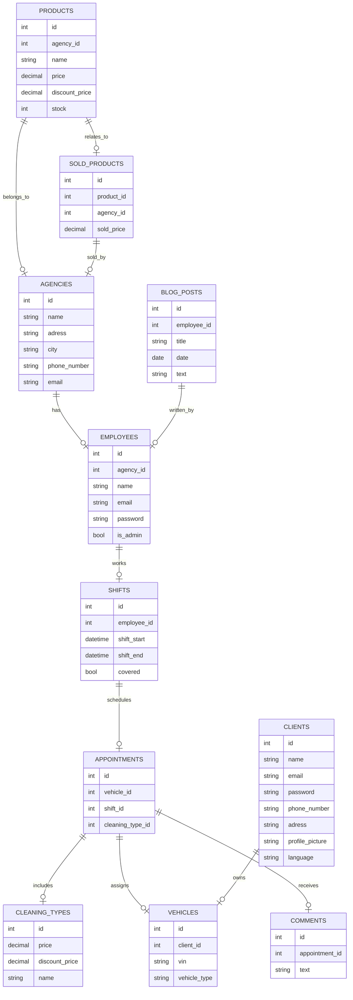

# Entity relation diagram

```mermaid
erDiagram
    AGENCIES {
        int id
        string name
        string adress
        string city
        string phone_number
        string email
    }

    APPOINTMENTS {
        int id
        int vehicle_id
        int shift_id
        int cleaning_type_id
    }

    BLOG_POSTS {
        int id
        int employee_id
        string title
        date date
        string text
    }

    CLEANING_TYPES {
        int id
        decimal price
        decimal discount_price
        string name
    }

    CLIENTS {
        int id
        string name
        string email
        string password
        string phone_number
        string adress
        string profile_picture
        string language
    }

    COMMENTS {
        int id
        int appointment_id
        string text
    }

    EMPLOYEES {
        int id
        int agency_id
        string name
        string email
        string password
        bool is_admin
    }

    PRODUCTS {
        int id
        int agency_id
        string name
        decimal price
        decimal discount_price
        int stock
    }

    SHIFTS {
        int id
        int employee_id
        datetime shift_start
        datetime shift_end
        bool covered
    }

    SOLD_PRODUCTS {
        int id
        int product_id
        int agency_id
        decimal sold_price
    }

    VEHICLES {
        int id
        int client_id
        string vin
        string vehicle_type
    }

    AGENCIES ||--o| EMPLOYEES : has
    EMPLOYEES ||--o| SHIFTS : works
    SHIFTS ||--o| APPOINTMENTS : schedules
    APPOINTMENTS ||--o| CLEANING_TYPES : includes
    APPOINTMENTS ||--o| VEHICLES : assigns
    CLIENTS ||--o| VEHICLES : owns
    PRODUCTS ||--o| SOLD_PRODUCTS : relates_to
    PRODUCTS ||--o| AGENCIES : belongs_to
    SOLD_PRODUCTS ||--o| AGENCIES : sold_by
    APPOINTMENTS ||--o| COMMENTS : receives
    BLOG_POSTS ||--o| EMPLOYEES : written_by
```
